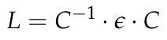
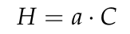
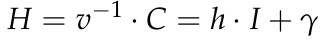
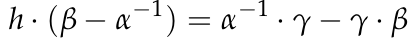
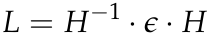

# Sarah's Cryptosystem (crypto, 33 solved, 60 points)

## Introduction
```
I had a friend who published this public key cryptosystem as part of her science fair project, but I'm not sure it's so secure...
```

[Public Key](https://github.com/Lev9L-Team/ctf/tree/master/2018-08-07_tjctf/sarahs_crypto/pubkey.txt)

[Ciphertext](https://github.com/Lev9L-Team/ctf/tree/master/2018-08-07_tjctf/sarahs_crypto/sarahs_enc.enc)

On the first look into the public key and the ciphertext, we remembered about a cryptographic algorithm,
which is similar to the RSA cryptosystem. We searched for the sarah's cryptosystem and now we was sure,
that we heard about them before. It is the Cayley-Purser algorithm. 

This algorithm is on big integers really fast. 

The first part was to read some documents to remember the algorithm in detail. 
The algorithm works with matrices in a modular ring. 

## The algorithm

The Caley-Pruser algorithm is a public-key cryptography algorithm, which encrypt a text with matrices.
The property of the matrices that there are not commutative are used in the algorithm.

The whole algorithm are explained on [mathworld](http://mathworld.wolfram.com/Cayley-PurserAlgorithm.html)
That is also the resource we read, to understand the algorithm in deep.

The interesting part of the algorithm is the decryption part. The decryption use the private matrix *C* 
and the *\epsilon* to compute a matrix *L* and the matrix *L* decrypt the encrypted message in the matrix.
The file [ciphertext](https://github.com/Lev9L-Team/ctf/tree/master/2018-08-07_tjctf/sarahs_crypto/sarahs_enc.enc)
contains the \mu^\prime, which the encrypted message is. 



The decryption are computed with the matrix *L*.


But how we can compute the matrix *C* for the decryption? 
It is really hard to compute *C* via *gamma = C^r*, where r is a random number of the natural numbers (N)

But we have luck! As described on [mathworld](http://mathworld.wolfram.com/Cayley-PurserAlgorithm.html)
the algorithm has a really bad property. It is possible to decrypt the message only with 
the public key. The public Key contains n, and all the other matrices to encrypt the message (alpha,beta,gamma).

We only need to compute a matrix *H*, which are a multiple of the private matrix *C*.



On [mathworld](http://mathworld.wolfram.com/Cayley-PurserAlgorithm.html) there explain the whole mathematics
behind the solution. But I am only interested in the computation of *H*.

How we can compute *H*?
Thanks to the [Cayley-Hamiltion theorem](http://mathworld.wolfram.com/Cayley-HamiltonTheorem.html),
there exist integers *u* and *v* so that *C = u \* I + v \* gamma*, with I is the identity matrix.
The conclusion is, that we can compute the matrix *H* as follow:



But how we can compute the factor of the identity matrix?
On [mathworld](http://mathworld.wolfram.com/Cayley-PurserAlgorithm.html) there is the explaination, 
how they are come up to compute the h. I am only interested in the resulting equation.

The resulting equation is:



Now we only need to divide elementwise through the matrix (\beta - \alpha^(-1)).
And the result is a matrix with the factor h as elements.
The matrix should only contain the same value for all elements. 
Now we can take an element of the matrix, which is the factor h. 

With the matrix *H* we can decrypt the encrypted message:




All the elements of the matrix \mu are parts of the message.

That is the theory on the paper!
But the integers are so big that we can not compute that by hand. 

## Crack Cayley-Purser algorithm with python and sageMath

To compute all the things, we used *sageMath* and *python*. 
As a note, all the operations have to made in the modular ring *n*

Firstly we take all the information from the files [Public Key](https://github.com/Lev9L-Team/ctf/tree/master/2018-08-07_tjctf/sarahs_crypto/pubkey.txt)
and [Ciphertext](https://github.com/Lev9L-Team/ctf/tree/master/2018-08-07_tjctf/sarahs_crypto/sarahs_enc.enc).

```python
    # reading and creating of matrices in python
    with open('pubkey.txt', 'r') as f:
        n = f.readline().replace('\n', '').replace('n=', '')
        n = int(n)
        alpha = f.readline().replace('\n', '').replace('\\alpha=', '').replace(' ', ',')
        beta = f.readline().replace('\n', '').replace('\\beta=', '').replace(' ', ',')
        gamma = f.readline().replace('\n', '').replace('\\gamma=', '').replace(' ', ',')
        alpha = eval(alpha)
        beta = eval(beta)
        gamma = eval(gamma)

    # reading and creating of matrices in python
    with open('sarahs_enc.enc','r') as enc:
        mu = enc.readline().replace('\\mu^\\prime=', '').replace('\n', '').replace(' ', ',')
        epsilon = enc.readline().replace('\\epsilon=', '').replace('\n', '').replace(' ', ',')
        mu = eval(mu)
        epsilon = eval(epsilon)
```

We used the eval function only to get a valid matrix from the file.

In the next step we used the possibility to compute the matrices with sage.
So firstly we have to convert the matrix from python to a matrix for sage and define the modular ring,
where the elemts of the matrices are in. 

```python
    ring = IntegerModRing(n)
    alpha = Matrix(ring, alpha)
    beta = Matrix(ring, beta)
    gamma = Matrix(ring, gamma)
    invalpha = alpha.inverse()
    epsilon = Matrix(ring, epsilon)
    mu = Matrix(ring, mu)
```

But we need also a function, which compute the division elementwise of matrices.

```python
def elementwise(operator, M, N):
    assert(M.parent() == N.parent())
    nc, nr = M.ncols(), M.nrows()
    A = zero_matrix(2,2)
    for r in xrange(nr):
        for c in xrange(nc):
            A[r,c] = operator(M[r,c], N[r,c])
    return A
```

The operator is the operator which are to use. In our case it is the *operator.div*.

Now it is quite easy to compute *h* and *H* to decrypt the encrypted message.

```python
    h = elementwise(operator.div, (invalpha * gamma) - (gamma * beta), beta - invalpha)
    H = (h[0][0] * identity_matrix(2)) + gamma
    
    # decryption
    la = H.inverse() * epsilon * H
    plaintext = la * mu * la
```

Plaintext is a matrix and all the elements of the matrix are the decrypted message. 
Now we have to print that to the console. 

```python
    print 'plain 1,1: ', str(hex(int(plaintext[0][0]))).replace('0x', '')[:-1].decode('hex')
    print 'plain 1,2: ', str(hex(int(plaintext[0][1]))).replace('0x', '')[:-1].decode('hex')
    print 'plain 2,1: ', str(hex(int(plaintext[1][0]))).replace('0x', '')[:-1].decode('hex')
    print 'plain 2,2: ', str(hex(int(plaintext[1][1]))).replace('0x', '')[:-1].decode('hex')
```

The result is the decrypted message. And we get the flag!!!

```
plain 1,1:  The Cayley-Purser algorithm was a public-key cryptography algorithm published in early 1999 by 16-year-old Irishwoman Sarah Flan
plain 1,2:  nery, based on an unpublished work by Michael Purser, founder of Baltimore Technologies, a Dublin data security company. Flanner
plain 2,1:  y named it for mathematician Arthur Cayley. It has since been found to be flawed as a public-key algorithm, but was the subject 
plain 2,2:  of considerable media attention. Nice job! Your flag is tjctf{c0uld_th1s_b3_tH3_n3Xt_RS4?}
```

When you read the [mathworld](http://mathworld.wolfram.com/Cayley-PurserAlgorithm.html) website, 
then you have to change the variables of A, B, G, to alpha, beta, gamma and so on, when you think in the space of the challenge.
 