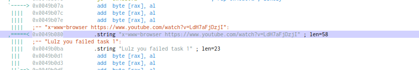
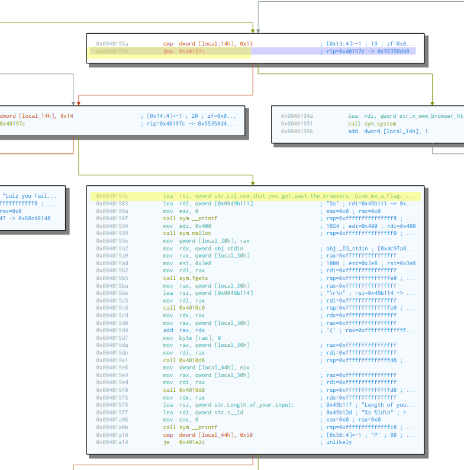
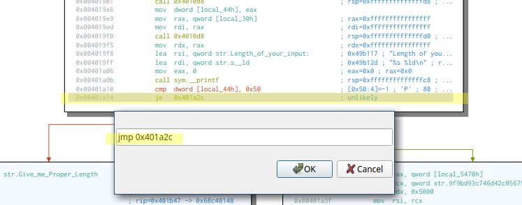
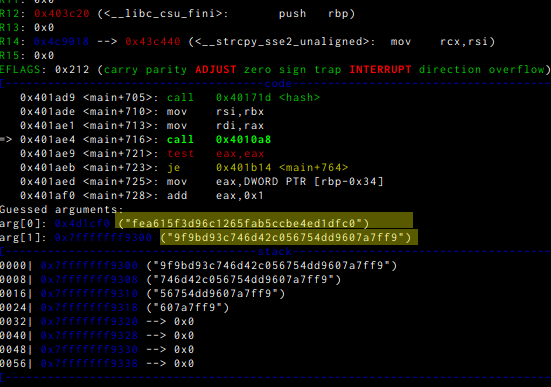

# revfcuk ;) (Pwn, 53 solved, 120 points)
###### Author: @qrzcn

```
Please make this file less annoying.
Also, find out what password works with it
```
There also was a binary given. 
When you run the binary, it tries to run a system with the string 
```
x-www-browser https://www.youtube.com/watch?v=LdH7aFjDzjI
```

Thats something we can use to search for in the binary in [Cutter](https://github.com/radareorg/cutter): 



After adding a function at offset 0x00401818 we can see the assembly we need. 

Seeing the funtion we can patch the instructions to always execute the block starting at 0x0040197c. 



Additionaly I patched the length check: 




Now we can step through the Programm with gdb and break at  0x401ae4 and get the comparing strings (with installed gdb-peda): 

```bash
% gdb ./exec_revfcuk
gdb-peda$ b *0x401ae4
Breakpoint 1 at 0x401ae4
gdb-peda$ set follow-fork-mode parent
```

and can see the hash that gets compared: 



Now we can use the second hash (9f9bd93c746d42c056754dd9607a7ff9) in format md5(md5()) and brute it in hashcat: 

```
$ hashcat -a 3 -m 2600 hashes ?a?a?a?a --show
```

and we get a list of broken hashes and now only need to assemble them into the flag: 

d4rk{pr0_at_r3v3rse_4nd_als0_gGWp_Y0u!_4r3_qul7e_gud_@t_thls_pls___teach_me}c0de

