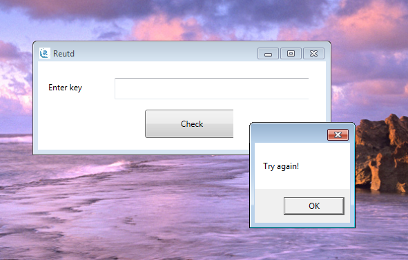
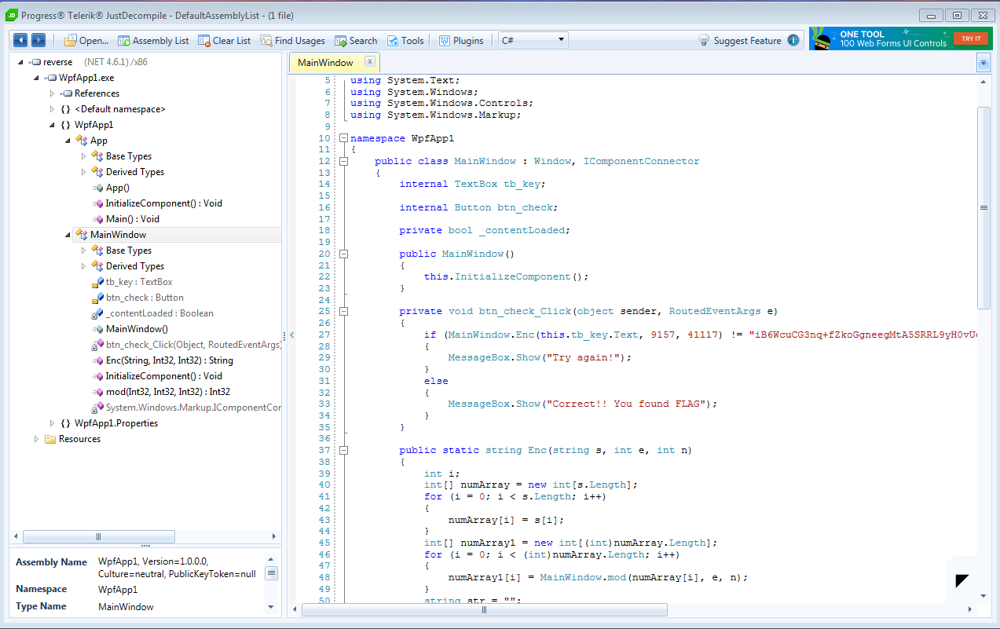

# re06 (reverse, 72 solved, 100 points)
###### Author: [qrzcn](https://github.com/qrzcn)

```
material.grandprix.whitehatvn.com/re06
Note: If you find flag in format WhiteHat{abcdef}, you should submit in form WhiteHat{sha1(abcdef)}
```

Given was a windows binary with a simple input and validation for a flag: 



First decompile the given binary using [JustDecompile](https://www.telerik.com/products/decompiler.aspx) and navigate to the MainWindow:

 

Now we have the source for the calculations to hit the MessageBox with the "Correct!! You found FLAG" String. The next thing i did was create a small shell programm to evaluate how much of the string is overlapping: [ConsoleApp.cs](ConsoleApp.cs)


Additionally, because I had a hard time programming it in C#, i used python to bruteforce it from the ascii range: 

```python
from pwintools import *
import operator
loot = ''
basistring = "WhiteHat{"
dataframe = {}
while (True) :

    for index in range(1,128):
        try:
            string = basistring + chr(index)
            r = Process("ConsoleApp2.exe")
            r.sendline(string)
            test = int(r.recvline(1))
            dataframe[test] = index
            r.close()
        except EOFError:
            pass
    basistring = basistring + "" + str(chr(max(dataframe.iteritems(), key=operator.itemgetter(0))[1]))

    if (chr(max(dataframe.iteritems(), key=operator.itemgetter(0))[1]) == '}'):
        break

print basistring

```

Now we run the script and after a little while get the flag: WhiteHat{N3xT_t1m3_I_wi11_Us3_l4rg3_nUmb3r}